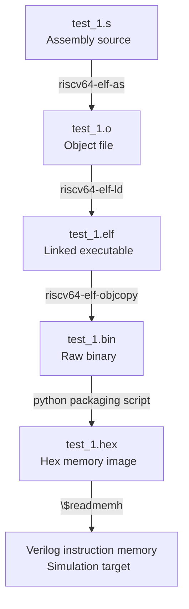

# Zeus TPU

## Basic Idea

TPU's are the backbone of the recent AI breakthroughs and as a hardware technology seem to be less complex and more optimized than modern cpu's.
All of these led to the decision of creating a tpu based on verilog as a personal project, to enhance the understanding of TPUS and AI and develop skills, specifically learning to create VLSI's with verilog.

## Project Outline

Since the creator of this repository is a complete beginner in all of these things it is better to break the process into smaller steps and targets before pushing through the creation of a complex general system.

## Inital steps for building the basic skills  

### Step 1

Create a register file as a structure in Verilog similar(or even almost identical) to the MIPS processor one and test it by reading and writing data on it.  
MIPS architecture was selected due to prior knowledge as well as availability of resources, though the register file will become RISC-V architecture in the near future.  

### Step 2

Create a simple ALU capable of basic arithmetic operations(on the MIPS architecture as well and then enhance it).  
Make the ALU perform vector operations and maybe add floating point arithmetic(though not necessary for small 4-bit quantized models)

### Step 3

Connect all the parts together. Create a single cycle pipeline capable of performing basic operations.

### Step 4

Add pipelining and finetune the architecture by creating a hazard mitigation unit and forwarding.  

### Step 5

Create or use an existing MIPS assembler based on this specific architecture and test the system.

### Step 6

Back to basics. Clean redesign of everything ISA, Cache and design choices.
Create a complete and organized plan for the TPU architecture.

### NEXT STEPS

Build, test, fail, iterate!  

### Project Progress

Restarted the project recently with the hope of mastering Verilog and SystemVerilog design techniques starting from the basics and scaling up.
Quickly noticed that building a TPU without a dedicated CPU would be a mistake so in the coming weeks I will be designing a RISC 5 stage pipelined CPU that will be used in parallel with the TPU.  

I am also working on discreet simulations for every part of the CPU that I am building, getting familiar with simulation tools that are going to help trace down errors quickly once the project is scaled.  

Just completed the basic ALU modules and now focusing on the wrapper as well as the register file.  
Main target for the coming days is building a single cycle basic system, then run tests and verifications on that before scaling and optimizing to a 5 stage pipeline with custom propagation units etc...

## ALU design choices and OPCODES

| Opcode (`3:0`) | Operation | Name | Description |
| --- | --- | --- | --- |
| `0000` | `ADD` | Addition | Adds `x` and `y`<br> |
| `0001` | `SUB` | Subtraction | Subtracts `y` from `x`<br> |
| `0010` | `AND` | Bitwise AND | Performs `x & y`<br> |
| `0011` | `SLT` | Set Less Than | Signed comparison: returns `1` if `x < y`, else `0`<br> |
| `0100` | `OR` | Bitwise OR | Performs `x | y`<br> |
| `0101` | `XOR` | Bitwise XOR | Performs `x ^ y`<br> |
| `0110` | `NOR` | Bitwise NOR | Performs `~(x | y)`<br> |
| `0111` | `SLTU` | Set Less Than Unsigned | Unsigned comparison: returns `1` if `x < y`, else `0`<br> |
| `1000` | `SLL` | Shift Left Logical | Logical left shift of `x` by shift amount `y`<br> |
| `1001` | `SRL` | Shift Right Logical | Logical right shift of `x` by shift amount `y`<br> |
| `1011` | LUI | Load upper immediate | ALU pass-through the second input |

### ALU Design choices

1.A common adder/subtractor was used so as to use the least amount of gates possible. Adding and subtracting is done with 2's compliment. Overflow and cout signals are also used and outputed by the ALU for possible future use.  
2. For all the other modules the operations are happening all at once and then with multiplexers the output is filtered to the output asked by the ALU op.  
3. The ALU operations that were chosen are the above(see table with opcodes). No not is used since this is done by nor(the assembler will later construct not as a pseudo-instruction). So the bitwise operations are more than enough for the usecase of running simple programs and testing.  
4. Multiplication and division will be done by different modules that will work in parallel with the ALU in the future.  
5. For shift operations only a small portion of the second inputs is used as it is the case with most RISC processors.  
> Pending: ALU simulation with the synthesized system and benchmark grading.  

 

| Metric | Value | Details / Notes |
| :--- | :--- | :--- |
| **Target FPGA** | Lattice iCE40-HX8K (`ct256`) | Synthesized via Yosys & nextpnr |
| **Total Propagation Delay** | **`18.84 ns`** | Maximum combinational input-to-output latency |
| **Max Frequency ($f_{MAX}$)** | **`53.08 MHz`** | Theoretical combinational clock limit ($\frac{1000}{18.84\text{ ns}}$) |
| **Logic Cell Utilization (LCs)** | **`529 / 7,680` (`6%`)** | 4-input LUT4s used across all submodules |
| **I/O Pin Usage** | **`103 / 256` (`40%`)** | 32-bit operands `x`, `y`, `result`, `opcode`, and status flags |
| **Logic Delay** | **`3.55 ns` (`18.8%`)** | Gate-level switching time |
| **Routing Delay** | **`15.29 ns` (`81.2%`)** | Interconnect routing wire latency across silicon |
| **Critical Path** | `x[5]` $\rightarrow$ `zero` flag | Output zero check bottlenecks on full result computation |

**Critical Path Timing Breakdown**

| Stage | Increment Delay | Total Elapsed | Component |
| :--- | :--- | :--- | :--- |
| **Source** | `0.00 ns` | `0.00 ns` | Input Pin `x[5]` (`$sb_io.D_IN_0`) |
| **Logic Processing** | `3.55 ns` | `3.55 ns` | Carry chains, shifter MUXes, logic gates, zero comparator |
| **Interconnect Routing** | `15.29 ns` | `18.84 ns` | Die wire routing across FPGA grid |
| **Sink** | `—` | `18.84 ns` | Output Pin `zero` (`$sb_io.D_OUT_0`) |

## REGISTER FILE  

### Design Choices  

1. The register file consists of 32 registers each capable of holding 32 bits. This design choice is not optimal for an ML/GPU architecture but the register file is written so to be modular so it can be repurposed in future architectures.  
2. There actually no physical $0 register! This is done so as to minimize gate usage so $0 it is actually hardwired to the ground.  
3. There is no read enabled and the read logic is completely combinational and thus unrelated to the clock. Write logic is however positively edge triggered in relation to the clock.  

> Place and routing simulations are conducted with the yosys-nextpnr toolchain  

| Metric | Value | Details / Notes |
| :--- | :--- | :--- |
| **Target FPGA** | Lattice iCE40-HX8K (`ct256`) | Synthesized via Yosys & nextpnr |
| **Logic Cell Utilization (LCs)** | **`2,868 / 7,680` (`37%`)** | 992 Flip-Flops + 1,874 MUX/decoder LUT4s |
| **Block RAM (BRAM) Usage** | **`0 / 32` (`0%`)** | Synthesized as Distributed RAM (Flip-Flops) |
| **I/O Pin Usage** | **`113 / 256` (`44%`)** | 2x Read Ports, 1x Write Port, Select lines, Clock |
| **Global Buffers (SB_GB)** | **`5 / 8` (`62%`)** | Clock and Write-Enable lines mapped to low-skew global trees |
| **Max Async Read Delay** | **`13.07 ns`** | Direct MUX read latency (`reg1_sel` $\rightarrow$ `reg1_data`) |
| **Clock-to-Output Latency** | **`9.29 ns`** | Clock edge to valid read data (`clk` $\rightarrow$ `reg2_data`) |
| **Write Enable Setup Path** | **`8.66 ns`** | Write address decode to register clock-enable setup |

**Critical Path Timing Breakdown (Async Read MUX Path)**

| Stage | Increment Delay | Total Elapsed | Component |
| :--- | :--- | :--- | :--- |
| **Source** | `0.00 ns` | `0.00 ns` | Input Pin `reg1_sel[1]` (`$sb_io.D_IN_0`) |
| **Logic Processing** | `1.76 ns` | `1.76 ns` | 32-to-1 Read MUXing logic layers |
| **Interconnect Routing** | `11.31 ns` | `13.07 ns` | Interconnect routing across 992 register flip-flops |
| **Sink** | `—` | `13.07 ns` | Output Pin `reg1_data[15]` (`$sb_io.D_OUT_0`) |

> Note: Actually discovered the limit of the yosys renderer so no physical image of the system could be made!(Render crashes)  

## ISA and more design decisions  

### Why RISC-V over MIPS?  

- Future TPU Integration: The RV32I specification explicitly reserves dedicated opcode space (custom-0 through custom-3) for custom instruction extensions. This provides a clean interface for adding matrix-multiplication and vector acceleration units (TPU) without altering standard decoder behavior.  

- Standard Register Alignment: Fixed bit fields for source (rs1, rs2) and destination (rd) registers allow register file read operations to occur in parallel with instruction decoding.  

- Modern Ecosystem: Aligns with current industry standards for open-source hardware accelerators.  
**For all the above reasons the RISC-V ISA will be used for the project**  

## Designing the Sign Extension module for immediate instructions  

For reference this is the RISC-V RV32I subset that is going to be used as the main ISA.  

### Canonical Base RV32I Subset

| Instruction | Type | Opcode (`[6:0]`) | Funct3 (`[14:12]`) | Funct7 (`[31:25]`) | Operation |
| --- | --- | --- | --- | --- | --- |
| `add` | R | `0110011` (`0x33`) | `000` | `0000000` | `rd = rs1 + rs2` |
| `sub` | R | `0110011` (`0x33`) | `000` | `0100000` | `rd = rs1 - rs2` |
| `and` | R | `0110011` (`0x33`) | `111` | `0000000` | `rd = rs1 & rs2` |
| `or` | R | `0110011` (`0x33`) | `110` | `0000000` | `rd = rs1 | rs2` |
| `xor` | R | `0110011` (`0x33`) | `100` | `0000000` | `rd = rs1 ^ rs2` |
| `slt` | R | `0110011` (`0x33`) | `010` | `0000000` | `rd = (rs1 < rs2) ? 1 : 0` (Signed) |
| `sltu` | R | `0110011` (`0x33`) | `011` | `0000000` | `rd = (rs1 < rs2) ? 1 : 0` (Unsigned) |
| `sll` | R | `0110011` (`0x33`) | `001` | `0000000` | `rd = rs1 << rs2[4:0]` |
| `srl` | R | `0110011` (`0x33`) | `101` | `0000000` | `rd = rs1 >> rs2[4:0]` |
| `addi` | I | `0010011` (`0x13`) | `000` | N/A | `rd = rs1 + SignExt(imm)` |
| `lw` | I | `0000011` (`0x03`) | `010` | N/A | `rd = Mem[rs1 + SignExt(imm)]` |
| `sw` | S | `0100011` (`0x23`) | `010` | N/A | `Mem[rs1 + SignExt(imm)] = rs2` |
| `beq` | B | `1100011` (`0x63`) | `000` | N/A | `if (rs1 == rs2) PC = PC + SignExt(imm)` |
| `jal` | J | `1101111` (`0x6F`) | N/A | N/A | `rd = PC + 4; PC = PC + SignExt(imm)` |

**So based on the type of the instruction (with a simple case statement in Verilog for the opcode) we are going to sign extend the specific field and produce as output a 32bit number**  
Here are the opcodes for the main instructions of the subset:  

| Instruction | Format | Opcode (`inst[6:0]`) |
| --- | --- | --- |
| add, sub, and, or, xor, slt, sltu, **sll, srl** | R | `0110011` |
| addi | I | `0010011` |
| lw | I | `0000011` |
| sw | S | `0100011` |
| beq | B | `1100011` |
| jal | J | `1101111` |

## Creating the control unit

### Main output signals of the control unit

| Signal | Purpose | Specifics |
| --- | --- | --- |
| `RegWrite` | Write-back specification | `0`: No WB, `1`: WB |
| `ALUSrc` | ALU's 2nd operand: register (`rs2`) or immediate | `00`: Register input, `01`:Second input for the ALU from immediate generator, `10` PC input |
| `MemRead` | For instructions that read from memory(lw,lb etc) | `0`: No need to read, `1`: Read from memory |
| `MemWrite` | For instructions that store data in memory(sw etc) | `0`: No write, `1`: Write to memory |
| `ResultSrc` | Write-back value comes from: ALU result, memory data, or `PC+4` (for `jal`)? | 2bit datatype. `00`: ALU result, `01`: Memory data, `10`: PC + 4 |
| `Branch` | Branch signal for PC updating | `0`: No branch, `1`: Branch |
| `Jump` | Is this `jal` (unconditional PC change)? (JAL AND JALR DISTINCTION) | `00`: Do not jump, `01`: Jump, `10` Jump to register |

## Final Integration

Final integration is happening in stages and verified at every part of the process.  
First the FETCH module was created and then connected to the main CPU module.  
Every module is connected gradually and then verified and tested with the CPU testbench script.  
Note that the cpu test script is mainly AI generated, a decision made for time efficiency, since it is updated in every part of the integration process.  
> Pending WB integration and C compiler toolchain support  
>
### Main setbacks and difficulties

#### Problem 1: LUI  

The LUI datapath could not be completed since there was no ALU pass-through opcode.  
**Solution:**  
A new opcode was created and the ALU rtl was updated to include that feature. Then the control unit was modified for the lui instruction and used that code to conduct the ALU pass-through and into the WB.  
Of course this is not a great performance decision since we could forward other tasks from other instructions into the ALU and get use of that in the pipeline, but it would a far more complex approach for a single instructions and the gains would be minimal.  

#### Problem 2: AUIPC  

This RISC-V instruction adds the upper immediate field to the PC.  
But no such prediction was made for the control unit. So there was practically no way to add the PC to anything more than the content of the rs1 register since the x input of the ALU was directly connected to the Register file.  
**Solution:**  
Create a AluA_Select that selects between the register file and the pc input.  
So the control unit and the overall cpu needed to be tweaked so as to accommodate this improvement.

#### Problem 3: Jump and Branch integration  

Detected an issue with jump signal since there is no distinguish between jal and jalr.  
**Solution:**  
Update jump signal to 2 bits and then select the next PC based on that.  
Also simplified fetch module so as to move PC control to the main CPU.  

### ALU_A_SRC signal Matrix

| ALU_A_SRC | Explanation |
| -------------- | --------------- |
| `0` | The first ALU input comes directly from the first output of the register file |
| `1` | The first ALU input is PC(only used as mentioned for the auipc instruction) |

### Testing of the integrated system

Testing of the basic system as well as submodules is conducted with the test script.
It conducts first individual and then complete testing of the pipeline.  
Note that this was gco-developed with github-copilot cli tool(basic script was human made and then copilot orchestrated the gradual integrated testing updates to the file).

## From RTL to running RISC-V assembly  

The assembler and linker integration was completed in the following order:

1. Smoke integrated testing included in the tb of the integrated CPU(simple assembly scripts decoded for our system with the help of AI)  
2. Use the GNU assembler and try to assemble a RISC-V simple program  
3. Write the custom linker script and verify it works  
4. Connect the output linker script to instruction memory and try and run that  
5. Use existing assembly benchmarks and measure the CPU performance and FPGA metrics.  

### Smoke test program

```assembly
addi x1, x0, 5
addi x2, x0, 7
add  x3, x1, x2
sw   x3, 0(x0)
lw   x4, 0(x0)
beq  x4, x3, +8
addi x5, x0, 99
addi x5, x0, 42
jal  x6, +8
addi x7, x0, 99
addi x7, x0, 11
```

The test verifies:

```assembly
mem[0] = 12
x3     = 12
x4     = 12
x5     = 42
x6     = 36      # JAL link address
x7     = 11
PC     = 48
```

### Memory Design Consideration

At the moment instruction and data memory are different modules.  
This choice was selected for transparency and simplicity reasons.  
Later they maybe merged into a single module.  

### Creating the Linker Script
>
> For now the linker script does not handle bss nor static data.  
*Static and stack implementation will be added in the near future.*

### Full toolchain implementation

For a test program called test_1:



#### Automation of the process

The complete simulation is conducted using 2 programs:

1. CPU/tb/cpu_image_tb.v
2. scripts/run_asm_test.sh

```command
scripts/run_asm_test.sh integrated_tests/test_1.s 12 8

```

**Arguments:**

1. Assembly filename
2. Expected dut.mem.mem[0] value
3. Number of execution cycles

#### Final Validation testing

For final validation some basic testing scripts were created.  
All of these run from the main directory with:  

```command
./scripts/final_validation.sh
```

And this runs all the scripts and simulations, compiles the whole verilog rtl and checks the script outputs with their expected values.  
Just for reference:  

 | Program | Expected mem[0] | RESULT |
 | --------------- | --------------- | --------------- |
 | add_sub.s | 25 | PASS |
 | logic.s | 30 | PASS |
 | memory.s | 130 | PASS |
 | branch_loop.s | 6 | PASS |
 | fibonacci.s | 34 | PASS |
 | upper_immediate.s | 411 | PASS |
