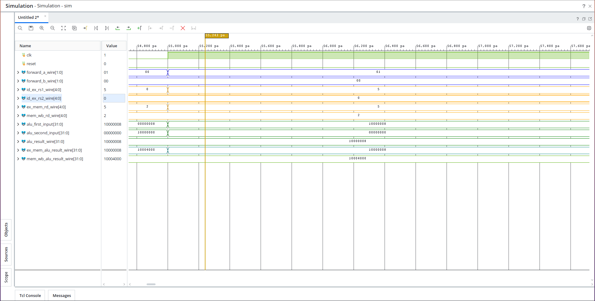
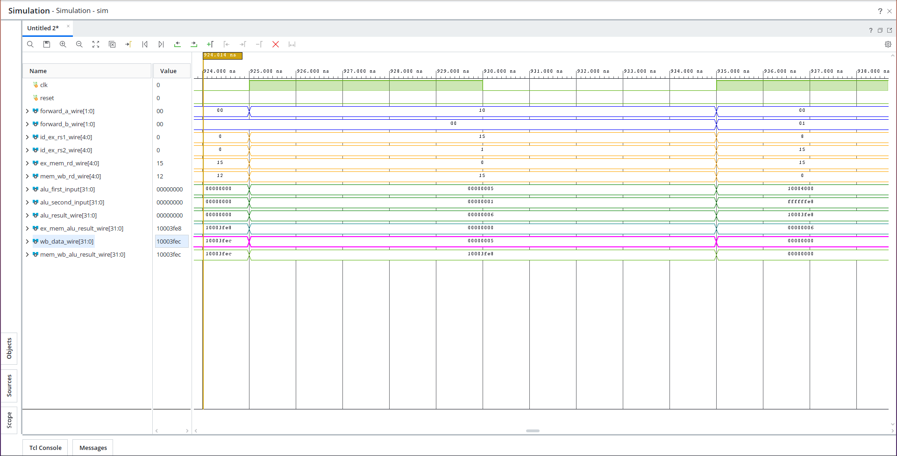
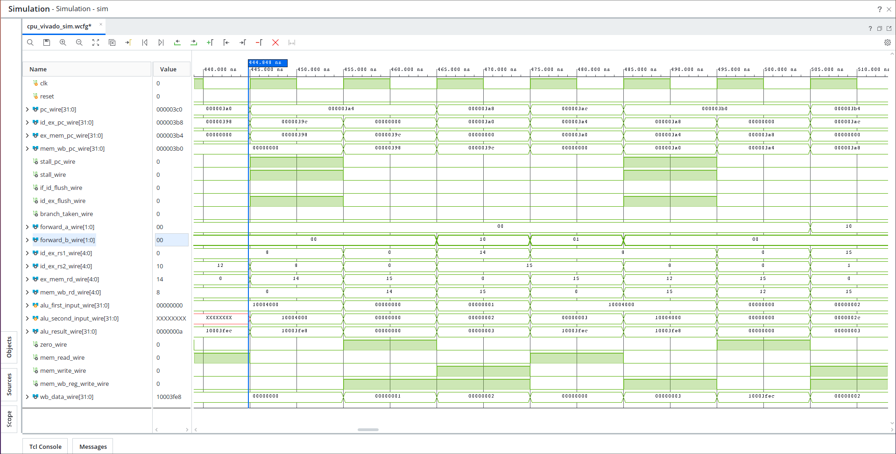
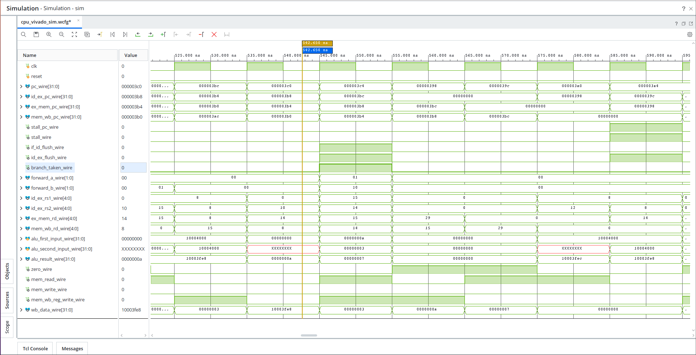
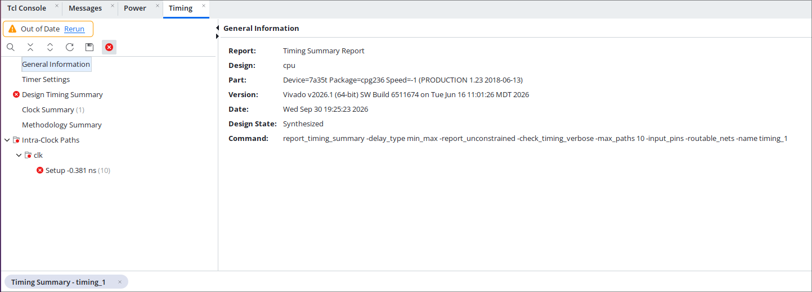
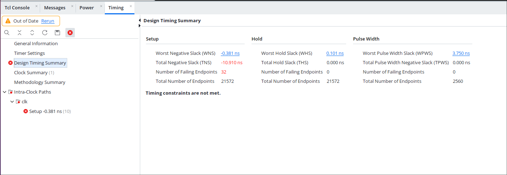
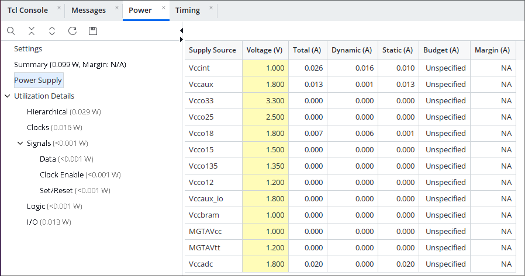

# The 5-Stage Pipeline

> **Status:** Functionally complete and passing the full regression suite (unit tests,
> integrated CPU tests, assembly benchmarks, and freestanding C programs). Synthesis,
> timing, and power characterization for the target board are in progress — see
> [Synthesis & FPGA Bring-Up](#synthesis--fpga-bring-up) below.

This document covers the conversion of Prometheus CPU from a single-cycle datapath into
a classic 5-stage pipeline: **IF → ID → EX → MEM → WB**. It focuses on the parts that
are actually interesting to an engineer reviewing the repo: how hazards are detected,
how they're resolved, and the waveform evidence that they work.

## Why pipeline it?

A single-cycle RV32I core is a fine learning project, but it wastes most of a clock
cycle's worth of hardware sitting idle while, say, the ALU or memory is busy. Splitting
the datapath into five overlapping stages lets five different instructions be in flight
at once, which is the standard first step toward a CPU that could plausibly clock
higher and do useful work every cycle. It's also the textbook RISC pipeline structure
(Patterson & Hennessy), which makes it a natural, well-understood target for an FPGA
learning project.

## Stage overview

| Stage | Job | Key hardware added this phase |
| --- | --- | --- |
| **IF** | Fetch the instruction at `PC`, compute `PC+4` | `if_id_reg` |
| **ID**  | Decode, read the register file, sign-extend the immediate | `id_ex_reg` |
| **EX**  | ALU operation, **branch/jump resolution**, address calculation | `ex_mem_reg`, forwarding muxes |
| **MEM** | Data memory access (load/store) | `mem_wb_reg` |
| **WB**  | Write the result back into the register file | write-through bypass in `reg_file` |

Each stage boundary is a dedicated pipeline register module
(`rtl/PIPELINE_REGS/{if_id,id_ex,ex_mem,mem_wb}_reg.v`) that latches every signal — data
*and* control — that the next stage needs. Keeping control signals (`RegWrite`,
`MemRead`, `ALUop`, etc.) traveling alongside the data they govern is what makes the
per-stage hazard logic tractable: every stage always knows exactly which instruction it
is currently working on.

## Design decisions worth calling out

- **Branches, `jal`, and `jalr` all resolve in EX**, not ID. The branch comparison uses
  the (possibly forwarded) ALU operands and `funct3`, so a taken branch is only known
  after the forwarding muxes have settled. This costs an extra bubble compared to
  resolving in ID, but it means the *same* forwarding hardware serves both data hazards
  and branch comparisons — no separate early-compare datapath.
- **A taken branch/jump flushes two bubbles**: `IF/ID` and `ID/EX` are both cleared the
  cycle the branch resolves, since both hold instructions from the wrong path.
- **Loads use a classic single-cycle stall.** A load-use hazard (the very next
  instruction needs the value a load hasn't fetched yet) freezes `PC` and `IF/ID` for
  one cycle and inserts a bubble into `ID/EX`.
- **These two hazards can never overlap** — the instruction sitting in EX is either a
  load (which can trigger a stall) or a branch/jump (which can trigger a flush), never
  both — so the flush and stall logic never has to arbitrate between the two.
- **The register file has a write-through bypass.** It's read/write-in-one-cycle
  (write-first), so an instruction reading a register in ID sees the value written back
  by an instruction in WB during that same cycle, without needing a forwarding path
  from WB back into ID.
- **The data memory is synchronous.** Reads land in a register on `negedge clk` (a
  simulation modeling choice to keep MEM's latency visible without a second pipeline
  register inside the stage) and writes commit on `posedge clk`. This also means the
  data memory can map cleanly onto FPGA block RAM later, which needs a synchronous
  read port.

## The hazard hardware

Two small, independent modules do all the hazard work:

### `forwarding_unit` (`rtl/FORWARDING_UNIT/rtl/forwarding_unit.v`)

Two 2-bit selects, `forward_a` and `forward_b`, one per ALU operand:

| Encoding | Source |
| --- | --- |
| `00` | Straight from `ID/EX` (no hazard) |
| `01` | Forwarded from `EX/MEM` (the instruction one ahead) |
| `10` | Forwarded from `MEM/WB` (the instruction two ahead) |

`EX/MEM` takes priority over `MEM/WB` when both match (it's the newer value), and `x0`
is never forwarded (it's hardwired to zero, forwarding it would be a bug).

### `hazard_detection_unit` (`rtl/HAZARD_DETECTION_UNIT/rtl/hazard_detection_unit.v`)

```verilog
stall        = id_ex_MemRead && id_ex_rd != 0 &&
               (id_ex_rd == if_id_rs1 || id_ex_rd == if_id_rs2);
stall_pc     = stall;
if_id_flush  = branch_taken;
id_ex_flush  = stall || branch_taken;
```

Load-use stalls hold the fetch stage in place for one cycle; a taken branch flushes the
two stages that hold wrong-path instructions.

## Waveform evidence

These are captures from the Vivado XSIM waveform viewer running the CPU testbench,
confirming the hazard hardware actually behaves as designed rather than just compiling
cleanly. Signal names match the wires in `rtl/CPU/rtl/cpu.v`.

### 1. Data hazard resolved by forwarding (EX/MEM → EX)



`forward_a_wire` switches from `00` to `01` exactly when `ex_mem_rd_wire` matches
`id_ex_rs1_wire`. `alu_first_input` picks up the value on `ex_mem_alu_result_wire`
directly — the ALU never has to wait for that result to reach the register file.

### 2. Data hazard resolved by forwarding (MEM/WB → EX)



The second, less obvious forwarding path: `forward_a_wire = 10` fires when the matching
producer is two instructions ahead (already in MEM/WB), and the ALU input tracks
`wb_data_wire` instead of a stale register-file read.

### 3. Load-use hazard resolved by stalling



`stall_wire`, `stall_pc_wire`, and `id_ex_flush_wire` all assert together for exactly
one cycle. `pc_wire` and `id_ex_pc_wire` visibly hold their values across that cycle
instead of advancing — proof the fetch stage is genuinely frozen, not just re-fetching
the same address by coincidence.

### 4. Control hazard: taken branch flush



`branch_taken_wire` pulses high for one cycle in EX, and `if_id_flush_wire` /
`id_ex_flush_wire` both assert on that same cycle — the two wrong-path instructions
that were fetched while the branch was still resolving are squashed before they can
retire.

## Performance metrics

A cycle-accurate performance monitor (`tb/perf_monitor.v`, testbench-only — it's not
part of the synthesizable design) tracks one valid bit per pipeline stage so that
stall and flush bubbles are **not** miscounted as retired instructions. It reports
CPI, stall cycles, and flush-bubble cycles alongside the existing correctness checks.

| Program | Cycles | Retired instructions | CPI | Stalls | Flush bubbles |
| --- | --- | --- | --- | --- | --- |
| `add_sub` | 10 | 6 | 1.67 | 0 | 0 |
| `logic` | 13 | 9 | 1.44 | 0 | 0 |
| `memory` | 11 | 6 | 1.83 | 1 | 0 |
| `upper_immediate` | 10 | 6 | 1.67 | 0 | 0 |
| `branch_loop` | 44 | 28 | 1.57 | 0 | 12 |
| `fibonacci` | 72 | 52 | 1.38 | 0 | 16 |
| `runtime_mem_test` (C, `-O0`) | — | 876 | 1.48 | 233 | 184 |

Two things stand out, and both are expected for a 5-stage in-order pipeline with no
branch prediction and no `-O` optimization on the C side:

- **Short programs look worse than they are.** A 6-10 instruction program pays almost
  the full 4-cycle pipeline fill-and-drain cost, so CPI is dominated by pipeline
  latency rather than steady-state throughput.
- **`-O0` C code stalls a lot.** Unoptimized GCC output chains almost every instruction
  to the one before it (spill/reload to the stack, no instruction scheduling), which is
  exactly the pattern that trips the load-use hazard. This is a solid argument for
  trying `-O2` as a follow-up experiment — expect the stall count to drop sharply.

The natural next step for the CPI story is adding a simple backward-taken branch
predictor (the "loops go backward" heuristic) to cut down the 2-bubble flush cost on
`branch_loop` and `fibonacci`, both of which are loop-heavy.

## Testing

Every existing testbench was updated for pipeline timing (not rewritten from scratch —
the same assertions, adapted for the new latency):

- `pc_tb.v` / `instruction_fetch_tb.v` — updated for the new `stop_pc` stall input.
- `reg_file_tb.v` — covers the write-through bypass.
- `memory_tb.v` — covers the synchronous (negedge-read) memory.
- `cpu_tb.v` — rewritten around three focused scenarios instead of cycle-by-cycle
  single-cycle assertions: (1) forwarding + load-use + store-data forwarding, (2) all
  six branch types + `jal`/`jalr` + wrong-path flush, (3) byte/halfword memory access.
- `forwarding_unit_tb.v` / `hazard_detection_unit_tb.v` — new, isolated unit tests for
  the two hazard modules.

All of the above run via `tools/run_tests/run_regression.sh`. The six assembly programs
in `tools/run_tests/final_validation.sh` and the freestanding C programs in
`programs/c/` (via `make run PROGRAM=...`) continue to pass unmodified — same expected
results as the single-cycle version, just pipelined.

## Synthesis & FPGA Bring-Up

**In progress.** The target board is a **Digilent Basys 3** (Xilinx/AMD Artix-7,
`xc7a35tcpg236-1`), synthesized with Vivado 2026.1. The core (`cpu.v`, top-level,
all five stages + pipeline registers + forwarding/hazard units) synthesizes cleanly
with 0 errors at a 100 MHz (10 ns) clock constraint, seeded with a real assembly
program (`build/assembly/memory/memory.hex`) via a synthesis-only `$readmemh` generic
so the numbers below reflect actual switching logic, not an all-NOP/all-zero memory.

**Resource utilization** (post-synthesis, `xc7a35tcpg236-1`):

| Resource       | Used  | Available | Utilization |
|----------------|-------|-----------|--------------|
| Slice LUTs     | 2,647 | 20,800    | 12.7%        |
| Slice Registers (FF) | 423 | 41,600 | 1.0%        |
| Block RAM      | 0     | 50        | 0% (mapped to distributed/LUT RAM instead — worth revisiting with a `ram_style` attribute) |
| DSP48          | 0     | 90        | 0%           |

**Timing** (constrained at 100 MHz / 10.000 ns period):

| Metric | Value |
|--------|-------|
| Worst Negative Slack (WNS) | -0.381 ns |
| Worst Hold Slack (WHS)     | 0.101 ns  |
| Worst Pulse Width Slack (WPWS) | 3.750 ns |
| Failing endpoints | 32 / 21,572 |
| Estimated max frequency (Fmax) | ≈ **96.3 MHz** (`1000 / (10.000 - (-0.381))`) |


*Vivado's `report_timing_summary` on the synthesized `cpu` design, targeting
`xc7a35t-cpg236 speed grade -1`, constrained at 100 MHz.*


*The "Setup -0.381 ns" red flag under Intra-Clock Paths → clk. This means the design
does not (yet) meet timing at exactly 100 MHz — explained below.*

**What the red "X" actually means, in plain terms:** Setup timing failing means at
least one combinational path between two flip-flops takes **longer** to settle than
one clock period allows (10.000 ns here). WNS = -0.381 ns means the *worst* such path
is 0.381 ns too slow — i.e. if the clock period were stretched from 10.000 ns to
10.381 ns (≈96.3 MHz instead of 100 MHz), that same path would just barely pass. This
is **not a functional bug** — the design still computes the correct logic; it just
can't do it in time at the requested clock speed. It shows up with real program
content (as opposed to an all-zero/all-NOP instruction memory, which trivially meets
timing because most of the datapath is constant and gets optimized away — see the
"Critical synthesis gotcha" note above). Only 32 endpoints out of 21,572 fail, and the
margin is small (well under 1 ns), so this is a normal, very fixable first-pass
timing result for a 5-stage pipeline with forwarding, not a fundamental architectural
problem. Likely culprits are the wide forwarding muxes feeding the ALU inputs directly
(`alu_first_input_wire`/`alu_second_input_wire` in `cpu.v`), or the ALU's carry chain
for wider operations (shifts/comparisons) — chasing the exact path is next steps.

Practical takeaway for now: the Basys 3 demo should be driven at a clock comfortably
below the current Fmax (e.g. 50 MHz via a clock divider/MMCM in `fpga_top`) rather than
100 MHz, to guarantee correct operation on real hardware while timing closure work
continues in parallel.

**Power** (vector-less estimate from the implemented netlist — no real switching
activity/SAIF supplied yet, so treat this as a rough ballpark, not a precise figure):

| Metric | Value |
|--------|-------|
| Total On-Chip Power | 0.099 W |
| Dynamic Power       | 0.029 W (29%) |
| Device Static Power | 0.070 W (71%) |
| Junction Temperature | 25.5 °C |
| Confidence level | Medium |


*Vivado's `report_power` summary on the implemented netlist: 0.099 W total, split
71%/29% static/dynamic. "Medium" confidence reflects that this is a vector-less
estimate (no real simulation switching activity supplied) — good for a ballpark,
not a datasheet-grade number.*

Remaining work before real hardware bring-up:

- A minimal FPGA top-level wrapper (`fpga_top`), since the `cpu` module's ~90-bit-wide
  debug ports vastly exceed the Basys 3's ~106 available I/O pins. The wrapper will
  expose only clock, a debounced reset button, switches, LEDs, and UART.
- Basys 3 XDC constraints (clock pin, buttons, switches, LEDs, UART pins).
- UART TX for exact result readout (reusing the existing `RESULT_MAILBOX`/`STATUS_MAILBOX`
  convention at `mem[0]`/`mem[1]` from the C runtime).
- Later, UART RX for program loading, needed for headless use on Intel's FPGA
  Developer Cloud (no physical switches/LEDs there).

Once this repo's synthesis results are in and hardware bring-up on the Basys 3 is
validated, the plan is to push the same RTL through a second, independent toolchain:
synthesizing and running it on real hardware via **Intel's FPGA Developer Cloud**,
with program loading over **UART**. That will be documented separately once underway.
